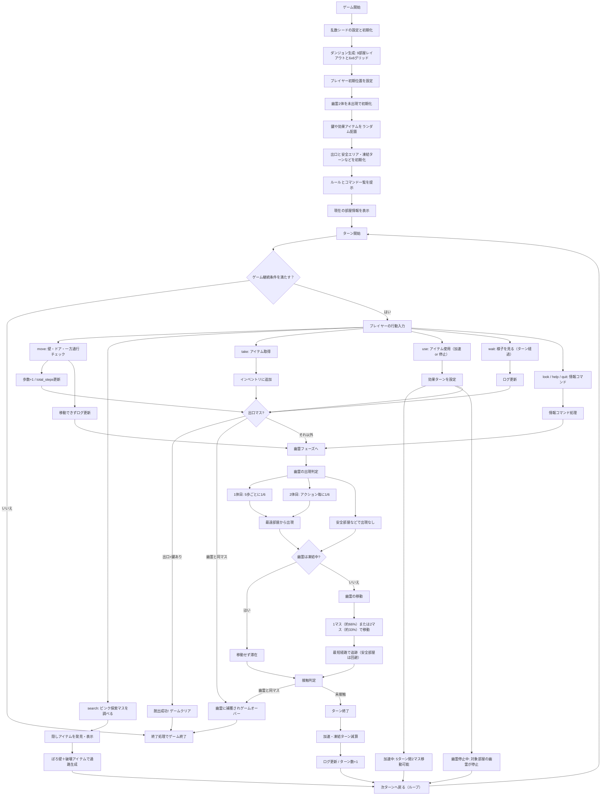

Haunted Ruin Escape (Digital Prototype)
=======================================

This repository hosts Team 7’s digital iteration of **「廃墟からの脱出」**, a turn-based escape game set inside a haunted school building. The codebase focuses on the programmable version of the rules (9 rooms, 6×6 grids, randomised items, dynamic ghost spawning) without relying on third-party libraries.

チーム7の脱出ゲーム「廃墟からの脱出」をデジタルで検証するためのリポジトリです。紙プロトタイプ向けの仕様をベースに、9部屋・6×6マスの迷路、ランダムなアイテム配置、幽霊の出現ルールなどをPythonで再現しています。

Project Layout / プロジェクト構成
----------------------------------

- `game_rule_doc.md` – 最新のデジタル版ルールメモ。
- `src/main.py` – CLI エントリポイント。
- `src/haikyo_escape/`
  - `dungeon.py` – 標準レイアウトとアイテム配置ジェネレータ。
  - `engine.py` – ターン制ループ／コマンド解釈／幽霊スポーン処理。
  - `entities.py` – プレイヤー・幽霊・アイテムのデータ構造。
  - `room.py` – 6×6マス、ドア、一方通行タイルの定義。
  - `state.py` – ゲーム状態、移動・探索ロジック、勝敗判定。
  - `types.py` – 方向や座標の共通型。
- `tests/test_state.py` – コア状態の単体テスト。

Getting Started / はじめに
--------------------------

1. **Environment / 環境**  
   Python 3.11 以上（標準ライブラリのみ使用）

2. **Run the prototype / プロトタイプ実行**  
   ```bash
   python src/main.py            # 利用可能なら int のシードを渡せます
   python src/main.py 42         # 例: シード 42 で固定
   ```

3. **Run tests / テスト実行**  
   ```bash
   python -m unittest discover -v
   ```

CLI Controls / コマンド一覧
---------------------------

Command | 説明
------- | ----
`move <dir …>` | Move 1–2 tiles depending on current speed. Example: `move north`, `move east north`. 方向は `north`, `south`, `east`, `west` もしくは `n/s/e/w`。
`search` | Reveal hidden items on the current tile. アイテムは見つけるだけで拾わない。
`take [all\|id\|index]` | Take visible items (`take all`, `take key_master`, `take 0` など)。
`use <id\|index>` | Use an inventory item (speed boost, ghost freeze, etc.)。
`wait` | ターンを消費して様子を見る。
`look` | 現在の部屋情報を再表示。
`inventory` / `inv` | 所持アイテム一覧。
`items` | 足元のアイテム一覧。
`log` | 直近 10 行のログを表示。
`help` | コマンド一覧を表示。
`quit` | セッションを終了。

Gameplay Notes / ゲームメモ
--------------------------

- **布局**: 9 rooms × 6×6 tiles. One-way passages and walls force route planning.
- **Items**: Randomly assigned per room at start. Master key (`is_master: True`) is required to unlock the exit. Speed boosts last 4–5 turns; ghost freeze items halt ghosts and room activity for a limited duration.
- **Ghosts**: Up to two active.  
  - First ghost: 1/6 spawn chance every time player’s total steps reach multiples of 5 (outside safe rooms).  
  - Second ghost: 1/6 chance after every action once the first ghost is out (also respecting safe rooms).  
  - Movement: 1 tile with probability 2/3, 2 tiles with probability 1/3, chasing the player via shortest path but respecting safe zones and freezes.
- **Victory**: Reach the exit tile with the true key.  
  **Defeat**: Share a tile with any active ghost.

Example Session / サンプル
--------------------------

```
$ python src/main.py 7
==========================================
 Haunted Ruin Escape (Text Prototype)
 Commands: move <dirs>, search, take, use, wait, quit
 Utility: help, look, inventory, items, log
 Seed: 7
==========================================

[Location] 廃墟の玄関ホール (r0)
 Position: (2, 5)
 Doors: east, south
 Explore tiles: (1, 1), (4, 4)
 Movement speed: 1 step(s) this turn
 No visible items on this tile.

Command > search
Revealed items: 氷結スプレー

Command > take all
Picked up 氷結スプレー.

Command > move north
A wall blocks the way.

Command > move east
> You step into 曲がりくねった廊下.
Player moved to r1
···
```

Development Tips / 開発メモ
-------------------------

- Use `build_default_dungeon` (in `dungeon.py`) to tweak room connections, item tables, or starting positions.
- `GameState` exposes helper methods for movement, pathfinding, freezing effects, and logging—prefer using them inside new systems.
- Ghost logic (spawn thresholds, movement rolls) is centralised in `engine.py`; adjust probabilities or rules there.
- To reproduce runs, pass an integer seed to `python src/main.py <seed>`.

Open TODOs / 今後の課題
----------------------

1. Balance the default dungeon layout and ghost difficulty through playtests.
2. Implement richer ghost AI tables or behaviours (e.g., patrols, noise attraction).
3. Add automated simulations to verify escape probability and pacing.
4. Replace CLI strings with structured command objects for downstream GUI work.
5. Extend tests to cover item usage, freeze timers, and one-way tile edge cases.

Flow Overview / フローチャート
------------------------------



1. **初期化 / Setup**
   - `build_default_dungeon()` でレイアウト・アイテム・開始位置を生成。
   - `GameState` を作成し、プレイヤー・幽霊・アイテムを配置。必要なら乱数シードを設定。
2. **ターン開始 / Start of Turn**
   - `GameState.tick_start_of_turn()` で速度・凍結などの残りターンを減算し、ログを更新。
3. **プレイヤー入力 / Player Action**
   - CLI からコマンドを取得し `GameEngine._resolve_player_action()` で処理。
   - `move` は壁・ドア・一方通行の判定を行い、成功時に歩数と `total_steps` を更新。失敗はログに記録。
   - `search` は探索マスの隠しアイテムを公開し、`take` はインベントリに追加した直後に勝利判定へ進む。
   - `use` は加速・凍結・通路生成などの効果ターンを設定し、`wait` はターン経過としてログを更新。
   - `look` / `help` / `quit` など情報系コマンドは状態確認やセッション終了の処理に遷移。
4. **勝敗判定① / Victory Check (player phase)**
   - `GameState.check_victory()` が鍵＋出口到達、または幽霊接触を確認。
5. **幽霊処理 / Ghost Phase**
   - `GameEngine._maybe_spawn_ghosts()` で 1/6 判定によるスポーンを実行。
   - `GameEngine._move_ghosts()` が各幽霊の移動距離をサイコロで決定し、最短経路で追跡。
6. **勝敗判定② / Victory Check (ghost phase)**
   - 幽霊移動後に再度 `check_victory()` を実行し、終了条件を確認。
7. **ループ継続 / Continue**
   - `GameState.is_over` が `False` なら次ターンへ。終了ならログと勝者を出力して終了。

Data Structures / データ構造
----------------------------

Name | Location | 説明
---- | -------- | ----
`DungeonSetup` | `haikyo_escape.dungeon` | 生成した部屋・アイテム・開始／出口情報をまとめたコンテナ。
`Room` | `haikyo_escape.room` | 幅・高さ・壁・探索マス・ドアを持つ6×6マス。ドア位置も記録。
`Door` | `haikyo_escape.room` | 接続先の部屋・ドア座標・鍵／一方通行情報を保持。
`Item` | `haikyo_escape.entities` | アイテム種別と配置座標、メタデータ（効果ターンなど）を持つ。
`ItemType` | `haikyo_escape.entities` | `KEY`, `DUMMY_KEY`, `GHOST_FREEZE`, `SPEED_BOOST`, `LORE` などの列挙型。
`Player` | `haikyo_escape.entities` | 現在位置・インベントリ・速度効果ターンを追跡。
`Ghost` | `haikyo_escape.entities` | 出現状態・凍結ターン・前回部屋を保持し、追跡AIに利用。
`GameState` | `haikyo_escape.state` | ループ中の mutable state（部屋・プレイヤー・幽霊・アイテム・カウンタ類）。
`Direction` | `haikyo_escape.types` | `N/E/S/W` のベクトルを提供する。

Key Variables / 主な変数
------------------------

Name | 所属 | 内容
---- | ---- | ----
`GameState.total_steps` | `haikyo_escape.state` | プレイヤーの累計移動マス数。5刻みで幽霊出現判定に使用。
`GameState.action_count` | `haikyo_escape.state` | 実行済みアクション数。ログや将来の分析向け。
`GameState.room_freeze_turns` | `haikyo_escape.state` | 部屋ID → 残り凍結ターンのマップ。
`GameState.safe_rooms` | `haikyo_escape.state` | 幽霊が侵入しない安全エリア集合。
`Player.speed_turns_remaining` | `haikyo_escape.entities` | 速度アップ効果の残りターン数。
`Ghost.frozen_turns` | `haikyo_escape.entities` | 個別幽霊の凍結残りターン。
`Ghost.is_spawned` | `haikyo_escape.entities` | まだ登場していない幽霊かどうかのフラグ。
`GameEngine.next_first_spawn_threshold` | `haikyo_escape.engine` | 最初の幽霊出現を再判定する累積歩数しきい値。

Key Functions / 主な関数
------------------------

Name | 役割
---- | ----
`build_default_dungeon(rng)` | 9部屋レイアウトとアイテム配置を生成し `DungeonSetup` を返す。
`GameEngine.run_turn()` | 1ターン分のプレイヤー行動 → 幽霊処理 → 勝敗判定を司るメインループ。
`GameEngine._resolve_player_action(action)` | CLI文字列を解析し `move/search/take/use/wait` などに振り分け。
`GameEngine._maybe_spawn_ghosts()` | 歩数・行動回数に応じた1/6判定で幽霊をスポーン。
`GameEngine._move_ghosts()` | 各幽霊の移動距離をダイスで決め、最短経路で追跡させる。
`GameState.move_player_step(direction)` | 1マス移動またはドア通過処理と壁チェックを実行。
`GameState.reveal_items_at_player()` | 現在マスの隠しアイテムを公開しログに残す。
`GameState.freeze_room(room_id, duration)` | 部屋に凍結効果を付与し幽霊移動を停止。
`GameState.check_victory()` | 鍵保持＋出口到達、または幽霊接触を検出してゲーム終了状態を更新。

Team Reference / メンバー
------------------------

- C0B23159 チンジュンミン
- C0B23145 山本真之介
- C0B23106 中島聖成
- C0B23085 新宮 尊

*Ghost movement uses randomness; expect different logs each run.*  
*幽霊の挙動は乱数に依存するため、出力ログは毎回変化します。*
