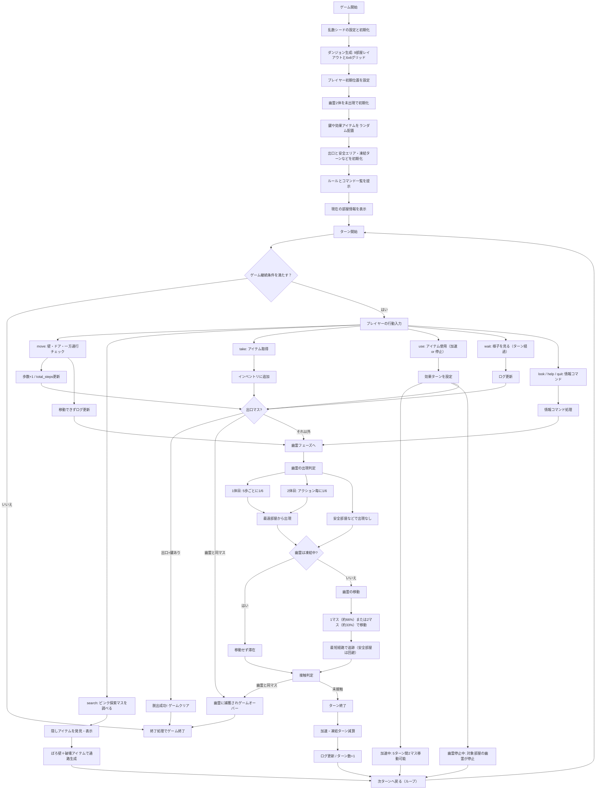

廃墟からの脱出（デジタルプロトタイプ）
==================================

このリポジトリはチーム7による脱出ゲーム **「廃墟からの脱出」** のデジタル検証版です。紙プロトタイプのルールを踏襲しつつ、9部屋 × 6×6グリッド、ランダムなアイテム配置、幽霊のスポーン／追跡ロジックなどを Python 標準ライブラリのみで再現しています。

ディレクトリ構成
----------------

- `game_rule_doc.md` – 最新のゲームデザインメモ。
- `src/main.py` – CLI 版の実行エントリポイント。
- `src/haikyo_escape/`
  - `dungeon.py` – 標準ダンジョン配置とアイテム生成。
  - `engine.py` – ターン制ループ、コマンド処理、幽霊スポーンの中枢ロジック。
  - `entities.py` – プレイヤー・幽霊・アイテムのデータ構造。
  - `room.py` – 6×6マスの部屋、壁、一方通行、脆い壁の定義。
  - `state.py` – ゲーム状態管理と移動・探索・勝敗判定のヘルパー。
  - `types.py` – 方向や座標などの共通型。
- `tests/test_state.py` – `GameState` を中心とした単体テスト。

# 開発の仕方につい
- `DEV_GUID.md` を確認

セットアップと実行
------------------

1. **環境**  
   Python 3.11 以上（外部ライブラリへの依存なし）。

2. **プロトタイプを起動**  
   ```bash
   python src/main.py        # 乱数シード未指定
   python src/main.py 42     # 例: シード 42 を固定
   ```

3. **テストを実行**  
   ```bash
   python -m unittest discover -v
   ```

コマンド一覧
------------

コマンド | 説明
------- | ----
`move <dir …>` | 現在の移動速度に応じて1～2マス移動。例: `move north`, `move east north`。方向は `north/south/east/west` または `n/s/e/w`。
`search` | 足元の探索マスを調べて隠しアイテムを公開。隣接する脆い壁があり破壊アイテムを所持していれば通路を生成。
`take [all\|id\|index]` | 可視化されたアイテムを取得。`take all`, `take key_master`, `take 0` など。
`use <id\|index>` | 所持品を使用（加速、幽霊停止など）。破壊アイテムは探索時に自動消費。
`wait` | 何もせずターンを経過させる。
`look` | 現在の部屋情報を再表示。
`inventory` / `inv` | 所持アイテム一覧を表示。
`items` | 足元に落ちているアイテムを表示。
`log` | 直近10件のログを表示。
`help` | コマンドヘルプを表示。
`quit` | セッションを終了。

ゲームのポイント
----------------

- **マップ構造**: 9部屋・各部屋 6×6 マス。壁や一方通行、脆い壁が進路計画に影響。
- **アイテム**: ゲーム開始時にランダム配置。真の鍵 (`is_master: True`) が出口解錠に必須。加速アイテムは4〜5ターン二歩移動、幽霊停止アイテムは部屋全体を凍結、破壊アイテムは探索時に隣接する脆い壁を崩落させる。
- **幽霊**: 最大2体が追跡。累計歩数5刻みで1体目を1/6判定、1体目登場後は各アクションごとに2体目を1/6判定。移動は2/3で1マス、1/3で2マス、最短経路で追跡。ただし安全部屋や凍結部屋は回避。
- **勝利条件**: 正しい鍵を所持したまま出口マスに到達。  
  **敗北条件**: 幽霊と同じマスに入るか、幽霊が滞在するマスに突入。

サンプルプレイ
--------------

```
$ python src/main.py 7
==========================================
 Haunted Ruin Escape (Text Prototype)
 Commands: move <dirs>, search, take, use, wait, quit
 Utility: help, look, inventory, items, log
 Seed: 7
==========================================

[Location] 廃墟の玄関ホール (r0)
 Position: (2, 5)
 Doors: east, south
 Explore tiles: (1, 1), (4, 4)
 Movement speed: 1 step(s) this turn
 No visible items on this tile.

Command > search
Revealed items: 氷結スプレー

Command > take all
Picked up 氷結スプレー.

Command > move north
A wall blocks the way.

Command > move east
> You step into 曲がりくねった廊下.
Player moved to r1
···
```

開発メモ
--------

- レイアウトやアイテム配分は `dungeon.py` の `build_default_dungeon()` を編集すると調整しやすい。
- 移動・探索・凍結処理などは `GameState` のヘルパー経由で呼び出すと状態遷移が一貫する。
- 幽霊の出現確率や移動ロジックは `engine.py` に集約されているため、難易度調整はここで行う。
- シード付きで再現したい場合は `python src/main.py <seed>` を利用。

今後の課題
----------

1. マップ？
2. 
3. 
4. 

進行フロー
----------



1. **初期化**  
   `build_default_dungeon()` で部屋・アイテム・開始地点を生成し、`GameState` に配置。必要なら乱数シードを設定。
2. **ターン開始処理**  
   `GameState.tick_start_of_turn()` で速度や凍結の残りターンを調整し、ログを追記。
3. **プレイヤー行動**  
   `GameEngine._resolve_player_action()` が CLI 入力を解釈し、移動・探索・取得・使用・待機・情報コマンドを処理。
4. **勝敗判定（プレイヤー側）**  
   `GameState.check_victory()` で出口到達＋鍵所持、幽霊との接触を判定。
5. **幽霊フェーズ**  
   `GameEngine._maybe_spawn_ghosts()` がスポーン判定、`_move_ghosts()` が最短経路移動を解決。
6. **勝敗判定（幽霊側）**  
   再度 `check_victory()` を呼び、捕獲や脱出を確認。
7. **ループ継続**  
   終了条件を満たしていなければ次ターンへ。終了時はログと勝者を出力。

データ構造
----------

名称 | モジュール | 説明
---- | ---------- | ----
`DungeonSetup` | `haikyo_escape.dungeon` | 生成済みの部屋、アイテム、開始／出口情報、安全部屋をまとめたコンテナ。
`Room` | `haikyo_escape.room` | 6×6 マスの部屋定義。壁・探索マス・ドア・脆い壁を保持。
`Door` | `haikyo_escape.room` | 接続先、ドア座標、鍵・一方通行設定を管理。
`Item` | `haikyo_escape.entities` | アイテム種別、設置位置、メタデータを表す。
`ItemType` | `haikyo_escape.entities` | `KEY`、`GHOST_FREEZE`、`SPEED_BOOST`、`WALL_BREAKER` などの列挙。
`Player` | `haikyo_escape.entities` | 現在位置、所持品、速度効果を保持。
`Ghost` | `haikyo_escape.entities` | 出現状態、凍結ターン、直前の部屋など追跡AIに必要な情報。
`GameState` | `haikyo_escape.state` | ゲーム全体の状態を保持し、ログやカウンタも管理。
`Direction` | `haikyo_escape.types` | `N/E/S/W` をユーティリティベクトルとして提供。
`Room.fragile_walls` | `haikyo_escape.room` | 破壊可能な壁の座標集合。

主な変数
--------

名称 | 所属 | 内容
---- | ---- | ----
`GameState.total_steps` | `haikyo_escape.state` | プレイヤーの累計移動マス数。1体目幽霊のスポーン判定に使用。
`GameState.action_count` | `haikyo_escape.state` | 実行済みアクション数。ログや分析用カウンタ。
`GameState.room_freeze_turns` | `haikyo_escape.state` | 部屋IDごとの凍結残りターン。
`GameState.safe_rooms` | `haikyo_escape.state` | 幽霊が侵入しない安全エリア集合。
`Player.speed_turns_remaining` | `haikyo_escape.entities` | 移動速度上昇の残りターン。
`Ghost.frozen_turns` | `haikyo_escape.entities` | 個別幽霊の凍結残りターン。
`Ghost.is_spawned` | `haikyo_escape.entities` | 幽霊が既に出現済みかどうか。
`GameEngine.next_first_spawn_threshold` | `haikyo_escape.engine` | 1体目幽霊の次回スポーン阈値（累計歩数）。

主な関数
--------

名称 | 役割
---- | ----
`build_default_dungeon(rng)` | 標準レイアウトとアイテム配置を生成して `DungeonSetup` を返す。
`GameEngine.run_turn()` | プレイヤー行動 → 幽霊処理 → 勝敗判定を1ターン分まとめて実行。
`GameEngine._resolve_player_action(action)` | CLI入力を解析し、`move` や `search` などに振り分け。
`GameEngine._maybe_spawn_ghosts()` | 歩数・アクション数に応じて1/6判定で幽霊をスポーン。
`GameEngine._move_ghosts()` | 各幽霊の移動距離を決定し、最短経路で追跡。
`GameState.move_player_step(direction)` | 1マス移動またはドア通過処理と壁チェックを行う。
`GameState.reveal_items_at_player()` | 隠しアイテムを公開し、破壊アイテムで脆い壁を通路化する。
`GameState.freeze_room(room_id, duration)` | 部屋全体に凍結効果を付与。
`GameState.check_victory()` | 鍵所持・出口到達・幽霊接触を判定し、ゲーム終了状態を更新。

チームメモ
---------

- C0B23159 
- C0B23145 
- C0B23106 
- C0B23085 

*幽霊移動には乱数が関わるため、プレイログは毎回異なります。*
